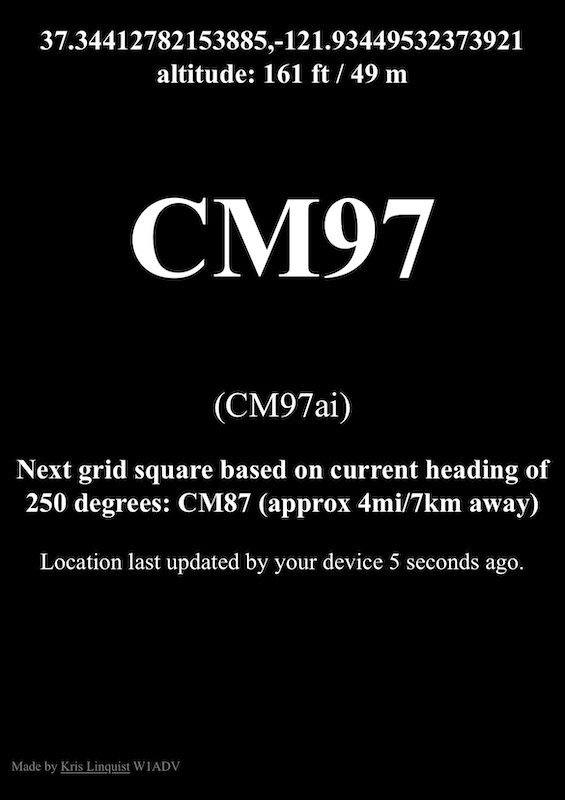

## My Grid Square

This is the code that can be found @ https://myGridSquare.com

## What is this?

A web page that shows your grid square!  What's a grid square?  Read [this](http://www.arrl.org/grid-squares).

I wrote this for two reasons:

1) Many new hams did not know their grid square.  Rather than googling for a random web page - or requiring an app - it's easy to tell someone "Just go to MY GRID SQUARE DOT COM!"
2) For mobile/roving contests, this page will constantly update, showing you if your grid square has changed. If your device reports heading, it'll also show you what grid square you are heading towards (and the approxmiate distance to it!)

This is 100% local/browser based HTML & JavaScript.  Once the page loads, your phone no longer needs connectivity.  Your location is not sent to any servers and no analytics are collected.

### Not working?

Make sure you have granted your browser location access.  General -> Privacy -> Location -> Safari on iOS.